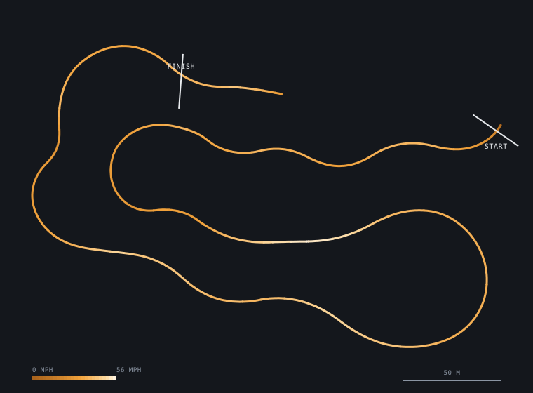
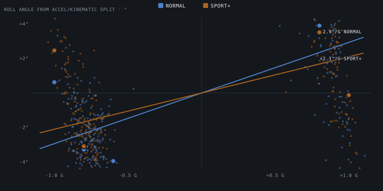

# vd-macan — instrumenting a Porsche Macan S

Raw data, processed data, and the code behind the Macan S instrumentation
project: one autocross day with a road car (95B Macan S, PASM adaptive
dampers on steel springs, Pirelli Scorpion Verde All-Season) and two small
loggers. The question is narrow: **do the PASM Normal and Sport+ damper
calibrations produce measurable, mode-attributable differences in
transient response, and do those differences match what the driver
reports?**

The write-ups live on the site's engineering log; this repository is
their evidence. Every number and figure in the day-1 post is regenerated
from the raw logs by one script (below). The living plan, with registered
predictions and a dated history of changes, is
[*Instrumenting a Macan S: the plan*](https://adaml.in/log/2026-08-05-macan-instrumentation-plan);
the first data post is
[*Six runs, two damper maps*](https://adaml.in/log/2026-08-16-six-runs-two-damper-maps).

The completed campaign is that one autocross day. There was no tire
experiment, instrument impulse experiment, or controlled-input ride work.
Tire work and controlled-input ride, step-steer, or constant-radius work
are future studies only after a suitable venue exists. Nothing in those
future studies is scheduled or reported as a result here.

## Reproduce

Python ≥ 3.9 and numpy. Python is the authoritative analysis for every
reported result; MATLAB is not required.

```sh
git clone https://github.com/adamlin1009/vd-macan
cd vd-macan
pip install -r requirements.txt                    # numpy only
(cd data/20260815_afternoon && shasum -a 256 -c SHA256SUMS)
(cd data/sd_dump_20260816 && shasum -a 256 -c SHA256SUMS)
python3 tools/day1_analysis.py                     # ~3 s
```

Expected console output (these are the numbers in the post):

```
runs: ['53.1s', '52.0s', '52.1s', '52.3s', '51.9s', '51.2s']; GPS virtual-gate calibration residual ~0.11 s
roll RMS deg/s: ['4.32', '4.81', '4.28', '4.59', '4.55', '4.95']
clock offsets 131 -> 182 s; xcorr 0.84-0.90; ay corr +0.79..+0.90; norm N 3.24 vs S+ 3.28
lat p95 0.97, max 1.14
roll gradient per run: ['+2.65', '+1.94', '+3.03', '+2.26', '+3.12', '+2.09']; N +2.93 S+ +2.10; exploratory roll-corrected grip p95 0.93 max 1.09
processed -> data/20260815_afternoon/processed
figures -> figures/day1
```

The script rewrites `data/20260815_afternoon/processed/` (per-run tables,
synchronized time series, `summary.json`) and `figures/day1/` (standalone
SVGs). Add `--post PATH` to also assemble the log post markdown, or
`--no-write` to only print. To characterize the IMU file itself (true
sample rate, timestamp health, duplicate fraction):

```sh
python3 tools/imu_characterize.py data/20260815_afternoon/imu_sd/WIT39.TXT
```

## Day 1 — Storm Stadium, 2026-08-15 (SCCA Cal Club autocross)

Six course runs in the afternoon session, PASM alternating
**Normal · Sport+ · Normal · Sport+ · Normal · Sport+**; powertrain mode
fixed in Sport+, PSM in Sport, cold pressures set to placard 37/40 psi
front/rear with the project's reference dial gauge (TPMS read 36/39 at
the start and 40/42 hot at the end), fuel 5/8 → 1/2 tank. Session notes,
including the driver's (non-blind, next-day) impressions, are in
[`data/20260815_afternoon/notes.md`](data/20260815_afternoon/notes.md).

| run | PASM | time [s] | vmax [mph] | peak lat [g] | roll-rate RMS [°/s] | roll gradient [°/g] |
|---|---|---|---|---|---|---|
| 1 | Normal | 53.1 | 53.3 | 1.05 | 4.32 | 2.65 |
| 2 | Sport+ | 52.0 | 57.1 | 1.09 | 4.81 | 1.94 |
| 3 | Normal | 52.1 | 55.1 | 1.06 | 4.28 | 3.03 |
| 4 | Sport+ | 52.3 | 55.3 | 1.04 | 4.59 | 2.26 |
| 5 | Normal | 51.9 | 53.5 | 1.06 | 4.55 | 3.12 |
| 6 | Sport+ | 51.2 | 55.6 | 1.14 | 4.95 | 2.09 |

Full precision in [`processed/runs.csv`](data/20260815_afternoon/processed/runs.csv);
definitions in [`processed/summary.json`](data/20260815_afternoon/processed/summary.json).



**What the data says so far**

- **Run times.** GPS virtual-gate estimates are shown to tenths. The gate
  calibration residual against two remembered official times is about
  0.11 s rms. Sport+ holds the best time and the mode means sit ~0.5 s
  apart, but run 4 (Sport+) was slower than both adjacent Normal runs and
  n = 3 per mode is thin. Not a result; a table.
- **Grip ceiling.** Registered prediction: 0.75–0.85 g. The primary
  measurements are the raw roof RaceBox values across all runs: p95
  0.97 g and peak 1.14 g. An exploratory correction for the estimated
  body-roll gravity leak gives 0.93 g and 1.09 g. Prediction busted
  upward; it stays in the text.
- **Roll rate.** IMU roll-rate RMS is *higher* in Sport+ (4.79 vs
  4.38 °/s, +9%); normalized by lateral-acceleration rate it is a wash
  (3.28 vs 3.24). Consistent with a firmer map making the body follow its
  inputs faster — or with the driver pushing harder in Sport+. A future
  matched-input study could separate the two, but only after a suitable
  venue exists.
- **Roll gradient (quasi-steady).** From the RaceBox alone, roll angle =
  accelerometer lateral minus v·yaw-rate/g at quasi-steady cornering
  samples: Normal 2.93 °/g (2.65–3.12), Sport+ 2.10 °/g (1.94–2.26); the
  per-run ranges do not overlap. A true steady-state gradient cannot split
  on unchanged springs and bars, so this is read as the dampers' transient
  contribution bleeding into a not-quite-steady measurement — the split
  shrinks as the steadiness mask is loosened. A true steady number would
  require a future constant-radius study at a suitable venue.



**Negatives worth recording:** roll transfer function per mode (coherence
< 0.6 everywhere — road and driver excite roll together on a course);
launch/brake pitch transients per mode (driver variance, roof lever arm);
dive/squat gradients (autocross braking is never quasi-steady, r ≈ 0);
repeated-bump ringdowns (three vertical events all session, none
recurring). Controlled-input follow-up is a future study only.

## Instruments, as characterized

| | RaceBox Mini S | WitMotion WT901SDCL-BT50 ("the AHRS IMU") |
|---|---|---|
| mount | roof, GNSS sky view | center console, cupholder perimeter, printed X arrow forward |
| record | 25 Hz GNSS + 6-axis IMU, app CSV export | 200 Hz frames to onboard storage (`WITn.TXT`), 28-byte `0x55 0x61` frames + device RTC |
| effective rate | 25.00 Hz | accel ≈ 104 Hz, gyro ≈ 50 Hz — the fusion loop repeats values in ~48% of frames; dedupe before spectra |
| clock | GNSS-disciplined; the session's reference | ticks a clean 5 ms *relative*, but ~2% slow absolute, and the offset re-arms at every power-on: 131 s behind GPS at run 1, 182 s at run 6. Corrected per file by a linear fit from run-envelope cross-correlation (r 0.84–0.90, residual ±130 ms) — see `processed/imu_clock.csv` |
| axes | GForceX + = accelerating; GForceY + and GyroZ + = left turn (ISO 8855 left-positive; GyroZ vs GPS heading rate r = 0.92, v·yaw vs GForceY r = 0.98) | ISO 8855 body axes: X forward, Y left, Z up. Verified in-car after the clock fix: ax↔GPS long, ay↔GPS lat (r ≤ 0.90), yaw↔yaw (r ≤ 0.91) |
| trust | lateral g carries a body-roll gravity leak (~4% at 2.5 °/g); no roll channel of its own | 6-axis fused Roll/Pitch angles are unusable under sustained lateral acceleration — rates and accelerations only |

Configuration, observed file behavior, mounting record, and session
procedure: [`docs/shakedown.md`](docs/shakedown.md).

## Method notes (short — the code is the reference)

- **Run detection and virtual gates** (`find_runs`): moving bouts (v > 4 m/s
  for > 20 s reaching > 20 m/s); start anchor = position where speed
  first crosses 5 m/s after launch (six anchors within 0.7 m); finish
  anchor = 5 m before the onset of the run's last sustained hard brake
  that terminates near standstill (4.4 m spread). Gate crossings are
  interpolated sign changes of the along-course coordinate within ±12 m
  cross-track. Both gates were then shifted along the course (start
  +2 m, finish −23 m) to fit two remembered official times (rms 0.11 s);
  the finish shift is the "you cross the lights flat-out and brake after"
  correction. Gate coordinates: `processed/gates.csv`.
- **IMU clock model** (`analyze_imu`): per SD file, offset(t) = a + b·t
  fit through per-run offsets found by maximizing the correlation between
  the RaceBox |g| envelope and the IMU |a_xy| envelope over a 100–220 s
  search; wall = device + offset. Deduped, clock-corrected per-run IMU
  windows are exported as `processed/runN_imu.csv`.
- **Roll-rate metrics**: RMS of IMU gyro X inside the gates; normalized
  version divides by the RMS time-derivative of RaceBox lateral g.
- **Roll gradient** (`roll_gradient`): φ ≈ (a_lat,accel − v·r/g), sampled
  on a 40 ms grid, masked to |v·r/g| > 0.30, |d(v·r/g)/dt| < 0.30 g/s,
  v > 8 m/s, |a_long| < 0.25 g; slope of a per-run least-squares line vs
  v·r/g. Samples: `processed/roll_gradient_samples.csv`. RaceBox-only on
  purpose — cross-device versions inherit the ±130 ms clock residual.
- **Grip ceiling**: |a_lat| while cornering (v > 8 m/s, |a_lat| > 0.3 g)
  inside the gates, all runs; roll correction divides by (1 + φ̄) with φ̄
  the mean roll gradient in radians per g.

## Limitations (read before quoting a number)

- n = 3 runs per mode, competition runs, one driver, one day.
- Mode-to-mode comparisons on course runs cannot separate "the car
  responded faster" from "the driver asked for more". Controlled-input
  work has not run and remains a future study after a venue exists.
- The subjective impressions in `notes.md` were recalled the day after,
  non-blind. Blind per-run rating sheets are part of the protocol going
  forward.
- Official run times were not recorded in the data; two remembered
  officials calibrated the gates.
- The morning session was driven but is excluded from analysis by
  decision (its IMU files are still in the card image for completeness).
- Ambient temperature and surface notes for day 1 are missing.

## Repository layout

```
data/
  README.md                       data dictionary: every file, column, unit, sign
  20260815_afternoon/             the analyzed session
    racebox.csv                   RaceBox "Track Session" export, 25 Hz, 53 min
    imu_sd/WIT38..41.TXT          IMU onboard-storage files covering the session
    app_capture/                  quick-look BLE captures (lossy; not used)
    notes.md                      configuration, conditions, run labels, impressions
    SHA256SUMS                    checksums of the raw files above
    processed/                    generated by tools/day1_analysis.py
      runs.csv                    one row per run: gates, times, peaks, IMU metrics
      gates.csv                   calibrated virtual gates (lat/lon, heading, shifts)
      imu_clock.csv               clock-offset anchors and per-file linear fits
      runN_racebox.csv            per-run RaceBox series (gates −3 s … +6 s)
      runN_imu.csv                per-run IMU series, deduped, clock-corrected
      roll_gradient_samples.csv   quasi-steady samples behind FIG 06
      summary.json                every headline number with its definition
  sd_dump_20260816/               untouched image of the IMU card (all sessions
                                  + shakedown files + SET.TXT config), checksummed
figures/day1/                     standalone SVGs of the six post figures
tools/
  day1_analysis.py                the day-1 analysis: gates → clock → metrics → tables/figures/post
  imu_characterize.py             IMU parser + file characterization report
  export_site_runs.py             RaceBox-only per-run export for the website's trace
matlab/                           unverified future work; status in matlab/README.md
docs/
  shakedown.md                    IMU config, file behavior, mount record, procedure
  day1-thread.md                  plain-language thread version of the day-1 write-up
```

## Analysis authority and MATLAB status

Python is the authoritative analysis and the only implementation used to
produce the reported day-1 results. The preserved MATLAB files are
unverified future work. None has been executed against this dataset, and
none supports a published result. Detailed file-by-file scope is in
[matlab/README.md](matlab/README.md).

## Standing rules

Predictions are registered before data is collected. Claims are scoped to
what the instrument can support. Maneuvers happen on closed courses only.
Cold pressures are set and logged every session. When a result embarrasses
a prediction, the prediction stays in the text.

## License

Code (`tools/`, `matlab/`) is MIT. Data (`data/`, `figures/`) and
documentation are CC BY 4.0 — reuse with attribution to Adam Lin and a
link to this repository. See [`LICENSE`](LICENSE).
